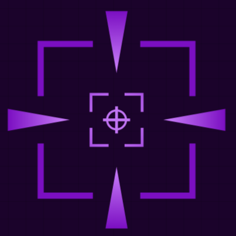

<p align="center">
  
</p>

<h1 align="center">Neurosniper</h1>

<p align="center">
  A sniper game controlled partly by your brain. An EEG headset reads your attention and meditation in real time, and they decide how steady your aim is.
</p>

---

## About the game

You start on a random rooftop above a busy city street with a sniper rifle. Somewhere in the crowd is your target. All you get is a short description, for example *"He is wearing a black suit and is acting nervously"*. Find him and take him out before the clock runs out.

The catch is that your rifle responds to your mind:

- **Attention** keeps your shots accurate. The more focused you are, the less your bullets scatter and the less quickly the scope trembles.
- **Meditation** keeps your hands steady. The calmer you are, the less the scope sways.

If the headset isn't connected or the signal is poor, the game assumes you're as distracted and tense as possible, so aiming is at its hardest.

## How to play

1. In the main menu, choose **Play**, pick a level and a rifle, and start.
2. Read the target's description on the HUD and scan the crowd through the scope.
3. Shoot the target. With the default rifle, a headshot kills in one hit, torso shots take two, and limb shots take more.
4. You win when the target is dead. You lose if the 2-minute timer runs out.

Things that make it harder:

- **Gunshots cause panic.** Every shot sends nearby NPCs running, including the target.
- **The drone.** A drone with a searchlight patrols the area. If its light finds you, you're warned with *"You have been detected!"* and the whole crowd panics.

### Controls

| Action | Key |
|---|---|
| Move | `W` `A` `S` `D` / arrow keys |
| Sprint | `Left Shift` |
| Look around | Mouse |
| Aim through the scope | Hold `Right mouse button` |
| Zoom (while aiming) | Mouse wheel |
| Shoot | `Left mouse button` / `Enter` |
| Pause | `Esc` / `Space` |

### HUD

- **Attention Level** and **Meditation Level** bars show the values coming from the headset (0–100%).
- The **brain icon** shows signal quality, from red (no signal) to green (good signal). EEG only affects aiming while it's fully green.

## EEG headset setup

Neurosniper reads EEG through the **ThinkGear protocol** used by NeuroSky headsets, such as the MindWave Mobile.

1. Pair the headset with your computer.
2. Start **ThinkGear Connector**. The game expects it at `127.0.0.1:13854`.
3. Start the game **after** ThinkGear Connector is running. The game only tries to connect once, at startup.
4. Put the headset on and wait for the brain icon to turn fully green.

The game is fully playable without a headset; aiming is just at its hardest.

Any program that implements the ThinkGear JSON protocol on the same port works too. For example, you could feed values from a different EEG device through a bridge.

## Running the project

### Requirements

- **Unity 6000.0.47f1** (Unity 6). Install it through Unity Hub.
- **Git** on your `PATH`. Unity needs it to download the Newtonsoft JSON package, which is installed from GitHub.
- An EEG headset is optional.

Built with the Universal Render Pipeline (URP), Cinemachine 3, the Input System and AI Navigation.

### Open and play in the editor

1. Clone the repository. The git history contains large asset files, so expect a download of about 2 GB.
   ```bash
   git clone git@github.com:KN-Neuron/Neurosniper.git
   ```
2. In Unity Hub, choose **Add → Add project from disk** and select the cloned folder. The first import takes a while.
3. Open `Assets/Scenes/MainMenu.unity` and press **Play**. You can also open `Assets/Scenes/Level1.unity` to jump straight into the level.

### Build

Open **File → Build Profiles**, check that the scene list contains `MainMenu` and `Level1` (in that order), and build for your platform.

`GameExe/` contains an older prebuilt Windows build. It doesn't include the latest changes, such as the performance fixes, so prefer building from source.

## Project structure

```
Assets/
├── Scripts/
│   ├── Camera/     Aim camera, zoom, EEG-driven scope sway, recoil
│   ├── EEG/        ThinkGear connection (EEGManager), HUD bars, signal icon, detection message
│   ├── Weapons/    Shooting, EEG-driven bullet scatter, bullets
│   ├── NPC/        NPC types and their behaviour states (idle, walking, phone, panic, ...)
│   ├── Entities/   Health, hitboxes, per-body-part damage multipliers, ragdoll interface
│   ├── Mission/    Win/lose conditions and the end-of-game flow
│   ├── Player/     Movement and random spawning
│   ├── Drone/      Searchlight drone that can spot the player
│   ├── PathC/      Moves the drone along its path
│   ├── Menu/       Main menu, level and weapon selection, settings, mission timer
│   └── Utils/      Game manager (pause, end screens), input wrapper, constants
├── Prefabs/        Player, NPC variants, Drone, UI
├── Scenes/         MainMenu and Level1 (in the build); ShootTest and SampleScene are for testing
└── Settings/       URP render pipeline assets and volume profiles
GameExe/            Older prebuilt Windows build
```

## Known limitations

- **Weapon choice is cosmetic.** The weapon selection screen shows each rifle's stats, but in-game you always get the rifle configured on the Player prefab.
- **There's only one level**, and level unlocking isn't connected to winning yet.
- **Shooting the wrong person doesn't count as a failure.** The only way to lose is running out of time.
- **EEG connection is attempted only at startup.** If ThinkGear Connector starts after the game, restart the game.

## Roadmap

- Support for multi-channel research EEG caps through a separate LSL-based service that speaks the same ThinkGear protocol.
- Weapon stats that affect gameplay, including how strongly each rifle reacts to attention and meditation.
- More levels and level progression.
- Automatic reconnection to the EEG source.

## Third-party assets

This project uses the following assets, each covered by its own license:

- **Synty Studios**: POLYGON City, POLYGON Adventure, POLYGON Knights
- **Polytope Studio**: Lowpoly Environments (Nature)
- **Unity**: Terrain Sample Assets
- **Handpainted Grass and Ground Textures**
- **TooManyCrosshairs**: scope and crosshair graphics
- **CorePro**: Flat Pack UI icons and fonts
- **Explosive LLC**: RPG Character Mecanim Animation Pack FREE
- **ithappy**: Weapons FREE
- **UI Soundpack**: menu sounds
- **Sebastian Lague**: Path Creator
- **TextMesh Pro**

## Authors

Made by members of [KN Neuron](https://github.com/KN-Neuron).
